# High-Level Design (HLD) - Sudoku Automation System

## 1. System Overview

The Sudoku Automation System is a comprehensive solution for generating, rendering, and publishing Sudoku puzzles across multiple platforms with multi-language support and interactive gameplay features.

### 1.1 Key Components

### 1.2 System Architecture

## 2. Core Components

### 2.1 Sudoku Generator
**Purpose:** Generate valid, solvable Sudoku puzzles with varying difficulty levels.

**Key Features:**
- Backtracking algorithm for complete grid generation
- Difficulty-based cell removal (Easy: 35-40, Medium: 45-50, Hard: 55-60)
- Solution uniqueness validation
- Grid validation (rows, columns, 3x3 boxes)

**Technology:** Pure Python with NumPy

### 2.2 Puzzle Renderer
**Purpose:** Create visually appealing puzzle images for social media.

**Key Features:**
- 1080x1080px Instagram-optimized format
- Modern dark theme with gradients
- Multi-script font support (10 Indian languages)
- Difficulty badges with color coding
- Dual rendering (puzzle + solution)

**Technology:** Python Pillow (PIL)

### 2.3 Localization Engine
**Purpose:** Provide multi-language support with native script rendering.

**Supported Languages:**
- English, Hindi, Tamil, Telugu, Bengali
- Marathi, Gujarati, Kannada, Malayalam, Punjabi

**Features:**
- JSON-based translation files
- Dynamic text loading
- Script-specific font selection
- Localized hashtags and captions

### 2.4 Social Media Poster
**Purpose:** Automated posting to multiple platforms.

**Supported Platforms:**
- Instagram (Graph API / instagrapi)
- Twitter/X (OAuth 2.0)
- Facebook (Graph API)
- Reddit (PRAW)

**Features:**
- Demo mode for testing
- Error handling and retry logic
- Posting history tracking
- Platform-specific formatting

### 2.5 Scheduler
**Purpose:** Automate twice-daily posting with difficulty rotation.

**Features:**
- APScheduler with cron triggers
- Timezone-aware scheduling
- Difficulty rotation pattern
- Manual trigger support

### 2.6 Interactive Website
**Purpose:** Public-facing puzzle solver with leaderboard.

**Features:**
- Real-time timer
- Hint system with scoring penalty
- Client-side validation
- Global leaderboard (top 100)
- KPI dashboard
- Social sharing

## 3. Data Flow

### 3.1 Manual Puzzle Generation Flow

### 3.2 Automated Posting Flow

```mermaid
sequenceDiagram
    participant Scheduler
    participant Generator
    participant Renderer
    participant Localization
    participant Poster
    participant SocialMedia
    
    Scheduler->>Scheduler: Cron trigger (9 AM / 6 PM)
    Scheduler->>Generator: create_puzzle(difficulty)
    Generator-->>Scheduler: puzzle + solution
    Scheduler->>Renderer: render_puzzle()
    Renderer-->>Scheduler: puzzle_image.png
    Scheduler->>Renderer: render_solution()
    Renderer-->>Scheduler: solution_image.png
    Scheduler->>Localization: format_caption()
    Localization-->>Scheduler: caption + hashtags
    Scheduler->>Poster: post_puzzle(platform, images, caption)
    Poster->>SocialMedia: POST /api/upload
    SocialMedia-->>Poster: post_id
    Poster->>Poster: Save to history
    Poster-->>Scheduler: Success
```

### 3.3 Interactive Gameplay Flow

### 3.4 GitHub Pages Deployment Flow

## 4. Deployment Architecture

### 4.1 Local Development

### 4.2 Production Deployment

## 5. Security Considerations

### 5.1 Credential Management
- API keys stored in `config.yaml` (excluded from git)
- Environment variables for production
- Masked in UI responses
- Session-based authentication for admin dashboard

### 5.2 Input Validation
- User puzzle solutions validated server-side
- Username sanitization for leaderboard
- Rate limiting on API endpoints
- CORS configuration for public website

### 5.3 Data Privacy
- No PII collection (optional usernames only)
- Leaderboard data is anonymous
- Session data expires after inactivity
- No tracking or analytics by default

## 6. Scalability Considerations

### 6.1 Current Capacity
- Supports unlimited puzzle generation
- Leaderboard: Top 100 entries
- User stats: Unlimited users
- Posting frequency: Configurable (default 2x/day)

### 6.2 Scaling Strategies
- **Database Migration:** Move from JSON to PostgreSQL/MongoDB
- **Caching:** Redis for leaderboard queries
- **CDN:** CloudFront/Cloudflare for image delivery
- **Load Balancing:** Multiple public website instances
- **Queue System:** RabbitMQ/Celery for posting jobs

## 7. Monitoring & Logging

### 7.1 Current Logging
- Python `logging` module
- Console output for all operations
- Posting history in JSON
- Error tracking in logs

### 7.2 Production Recommendations
- **APM:** Application Performance Monitoring (New Relic, Datadog)
- **Error Tracking:** Sentry for exception monitoring
- **Analytics:** Google Analytics for website traffic
- **Uptime Monitoring:** Pingdom, UptimeRobot
- **Log Aggregation:** ELK Stack, Papertrail

## 8. Technology Stack

### 8.1 Backend
- **Language:** Python 3.11+
- **Web Framework:** Flask 3.0
- **Scheduler:** APScheduler 3.10
- **Image Processing:** Pillow 10.3
- **Data Processing:** NumPy 1.26

### 8.2 Frontend
- **HTML5 + CSS3**
- **Vanilla JavaScript** (no framework dependencies)
- **Responsive Design** (mobile-friendly)

### 8.3 Infrastructure
- **Version Control:** Git + GitHub
- **CI/CD:** GitHub Actions
- **Hosting Options:**
  - Local: Development/Admin
  - GitHub Pages: Static daily puzzle
  - Render/Railway: Public website
  - VPS: Scheduler + Admin

### 8.4 External Dependencies
- Instagram Graph API / instagrapi
- Twitter API v2 (tweepy)
- Facebook Graph API
- Reddit API (PRAW)

## 9. Future Enhancements

### 9.1 Short Term
- Email notifications for leaderboard rank
- Weekly/monthly leaderboard archives
- Puzzle difficulty auto-tuning
- Multi-user admin access

### 9.2 Long Term
- Mobile apps (React Native)
- Real-time multiplayer mode
- AI-powered hint suggestions
- Custom puzzle upload
- Puzzle difficulty rating by users
- Achievement system with badges
- Social features (friends, challenges)

## 10. System Metrics

### 10.1 Performance Targets
- Puzzle generation: < 1 second
- Image rendering: < 2 seconds
- API response time: < 500ms
- Website load time: < 2 seconds

### 10.2 Reliability Targets
- System uptime: 99.5%
- Posting success rate: 95%
- Data durability: 99.9%

---

**Document Version:** 1.0  
**Last Updated:** 2025-11-28  
**Author:** Automated Sudoku System Team
