# Low-Level Design (LLD) - Sudoku Automation System

## 1. Module Specifications

### 1.1 Sudoku Generator (`sudoku_generator.py`)

#### Class: `SudokuGenerator`

**Purpose:** Generate valid Sudoku puzzles using backtracking algorithm.

**Class Diagram:**


#### Method Details:

**`create_puzzle(difficulty: str) -> (list, list)`**
```python
Input: difficulty = 'easy' | 'medium' | 'hard'
Output: (puzzle_grid, solution_grid)
Time Complexity: O(n²) average case
Space Complexity: O(n²)

Algorithm:
1. Generate complete grid using backtracking
2. Deep copy for solution storage
3. Calculate cells_to_remove based on difficulty
4. Randomly remove cells while maintaining solvability
5. Return (puzzle, solution)
```

**State Machine:**


**Data Structures:**
```python
grid: List[List[int]]
    - 9x9 matrix
    - 0 represents empty cell
    - 1-9 represents filled numbers

DIFFICULTY_RANGES: Dict[str, Tuple[int, int]]
    {
        'easy': (35, 40),
        'medium': (45, 50),
        'hard': (55, 60)
    }
```

---

### 1.2 Puzzle Renderer (`puzzle_renderer.py`)

#### Class: `PuzzleRenderer`

**Class Diagram:**


#### Rendering Pipeline:


**Color Scheme:**
```python
COLORS = {
    'background': '#0F172A',      # Dark blue-gray
    'background_end': '#1E293B',  # Slightly lighter
    'grid_bg': '#1F2937',         # Grid background
    'cell_bg': '#FFFFFF',         # Cell background
    'given_cell': '#F9FAFB',      # Pre-filled cells
    'text': '#1F2937',            # Dark text
    'accent': '#3B82F6',          # Blue accent
}

DIFFICULTY_COLORS = {
    'easy': '#10B981',    # Green
    'medium': '#F59E0B',  # Orange
    'hard': '#EF4444',    # Red
}
```

**Font Handling:**
```python
Font Selection Logic:
1. Check custom fonts directory for script-specific font
2. Fall back to Windows system fonts (C:\Windows\Fonts)
3. Try Nirmala UI (supports all Indian scripts)
4. Ultimate fallback: PIL default font

Supported Scripts:
- Latin: Arial, Segoe UI
- Devanagari: Nirmala UI, Mangal
- Tamil: Nirmala UI
- Telugu: Nirmala UI
- Bengali: Nirmala UI, Vrinda
- Gujarati: Nirmala UI, Shruti
- Kannada: Nirmala UI, Tunga
- Malayalam: Nirmala UI, Kartika
- Gurmukhi: Nirmala UI, Raavi
```

---

### 1.3 Localization Engine (`localization.py`)

#### Class: `Localization`

**Class Diagram:**


**Translation File Structure:**
```json
{
  "difficulty": {
    "easy": "आसान",
    "medium": "मध्यम",
    "hard": "कठिन"
  },
  "ui": {
    "daily_sudoku": "दैनिक सुडोकु",
    "solution": "समाधान",
    "puzzle_number": "पहेली संख्या"
  },
  "captions": {
    "template": "🧩 {} सुडोकु चुनौती!...",
    "call_to_action": "क्या आप इसे हल कर सकते हैं?"
  },
  "hashtags": {
    "base": ["सुडोकु", "पहेली", "Sudoku"],
    "easy": ["आसानसुडोकु", "EasySudoku"],
    "medium": ["मध्यमसुडोकु", "MediumSudoku"],
    "hard": ["कठिनसुडोकु", "HardSudoku"]
  }
}
```

**Text Retrieval Flow:**

```mermaid
sequenceDiagram
    participant Client
    participant Localization
    participant Cache
    participant FileSystem
    
    Client->>Localization: get_text('hi', 'ui.daily_sudoku')
    Localization->>Cache: Check if 'hi' loaded
    alt Not in cache
        Localization->>FileSystem: Read locales/hi.json
        FileSystem-->>Localization: JSON data
        Localization->>Cache: Store translations
    end
    Localization->>Localization: Traverse key path
    Localization-->>Client: "दैनिक सुडोकु"
```



---

### 1.4 Social Media Poster (`social_media_poster.py`)

#### Class: `SocialMediaPoster`

**Class Diagram:**


**Posting Flow:**


**Platform-Specific Implementation:**

**Instagram:**
```python
Method: _post_instagram
Libraries: instagrapi (recommended) or Instagram Graph API
Authentication: Username/Password or Access Token
Limitations:
  - Max 10 images per carousel
  - 2200 character caption limit
  - Rate limit: ~25 posts/day
Steps:
  1. Login/authenticate
  2. Upload media
  3. Create caption with hashtags
  4. Post as single/carousel
  5. Return post_id
```

**Twitter/X:**
```python
Method: _post_twitter
Libraries: tweepy
Authentication: OAuth 2.0 (API keys + tokens)
Limitations:
  - Max 4 images per tweet
  - 280 character limit
  - Rate limit: 300 tweets/3hrs (free tier)
Steps:
  1. Authenticate OAuth session
  2. Upload media files
  3. Get media_ids
  4. Create tweet with media_ids
  5. Return tweet_id
```

**Reddit:**
```python
Method: _post_reddit
Libraries: PRAW
Authentication: Client ID + Secret + Username/Password
Limitations:
  - Subreddit-specific rules
  - Karma requirements
  - Rate limit: ~1 post/10min (new accounts)
Steps:
  1. Authenticate with PRAW
  2. Get subreddit object
  3. Submit image post
  4. Return submission_id
```

---

### 1.5 Scheduler (`scheduler.py`)

#### Class: `SudokuScheduler`

**Class Diagram:**


**Scheduling Mechanism:**


**Difficulty Rotation Pattern:**
```python
DIFFICULTY_ROTATION = ['easy', 'medium', 'hard', 'medium', 'easy', 'hard']
# 6-day cycle ensures variety
# post_counter % 6 determines current difficulty

Day 1 (post 1, 2): easy, medium
Day 2 (post 3, 4): hard, medium
Day 3 (post 5, 6): easy, hard
Day 4 (post 7, 8): easy, medium
...
```

---

### 1.6 Interactive Website Backend (`public_website.py`)

#### API Endpoints:

```mermaid
graph LR
    A[Client] -->|GET| B[/]
    A -->|POST| C[/api/new-puzzle]
    A -->|POST| D[/api/validate-solution]
    A -->|POST| E[/api/submit-score]
    A -->|GET| F[/api/leaderboard]
    A -->|GET| G[/api/user-stats/:username]
    A -->|GET| H[/api/kpi]
    
    B --> I[Serve puzzle.html]
    C --> J[Generate & store in session]
    D --> K[Compare with session solution]
    E --> L[Calculate score & update leaderboard]
    F --> M[Return filtered entries]
    G --> N[Return user statistics]
    H --> O[Return system KPIs]
```

#### Scoring Algorithm:

```python
def calculate_score(difficulty: str, time_seconds: int, hints_used: int) -> int:
    """
    Score Formula:
    Total = Base + Time Bonus - Hint Penalty
    
    Base Scores:
      easy: 100
      medium: 200
      hard: 300
    
    Time Bonus:
      max_bonus = 100
      bonus = max(0, 100 - (time_seconds / 10))
      # Linear decay: lose 10 points per 100 seconds
    
    Hint Penalty:
      penalty = hints_used * 20
    
    Minimum Score: 10
    """
    base = {'easy': 100, 'medium': 200, 'hard': 300}[difficulty]
    time_bonus = max(0, 100 - (time_seconds / 10))
    hint_penalty = hints_used * 20
    
    return max(10, int(base + time_bonus - hint_penalty))
```

**Leaderboard Data Structure:**
```python
[
    {
        "username": "Player123",
        "score": 385,
        "difficulty": "hard",
        "time": 245,  # seconds
        "hints_used": 1,
        "timestamp": "2025-11-28T10:30:00",
        "date": "2025-11-28"
    },
    # ... top 100 entries sorted by score DESC
]
```

**User Statistics Structure:**
```python
{
    "Player123": {
        "total_puzzles": 15,
        "total_score": 4250,
        "best_score": 385,
        "puzzles_by_difficulty": {
            "easy": 5,
            "medium": 7,
            "hard": 3
        },
        "average_time": 320.5,
        "total_time": 4808
    }
}
```

---

### 1.7 Static Site Generator (`scripts/generate_static.py`)

**Generation Flow:**


**Template Injection:**
```python
# Template placeholders
{{ puzzle_json }}    # Replaced with JSON.stringify(puzzle)
{{ solution_json }}  # Replaced with JSON.stringify(solution)
{{ meta_json }}      # Replaced with JSON.stringify({date, difficulty})

# Example output in HTML:
const PUZZLE = [[5,3,0,...], [6,0,0,...], ...];
const SOLUTION = [[5,3,4,...], [6,7,2,...], ...];
const META = {"difficulty": "medium", "date": "2025-11-28"};
```

---

## 2. Database Schema (JSON Files)

### 2.1 Leaderboard (`data/leaderboard.json`)

```json
{
  "$schema": "leaderboard_schema",
  "type": "array",
  "maxItems": 100,
  "items": {
    "type": "object",
    "required": ["username", "score", "difficulty", "time", "timestamp"],
    "properties": {
      "username": {"type": "string", "maxLength": 50},
      "score": {"type": "integer", "minimum": 10},
      "difficulty": {"enum": ["easy", "medium", "hard"]},
      "time": {"type": "integer", "minimum": 0},
      "hints_used": {"type": "integer", "minimum": 0},
      "timestamp": {"type": "string", "format": "date-time"},
      "date": {"type": "string", "format": "date"}
    }
  }
}
```

### 2.2 User Stats (`data/user_stats.json`)

```json
{
  "$schema": "user_stats_schema",
  "type": "object",
  "patternProperties": {
    "^[a-zA-Z0-9_]+$": {
      "type": "object",
      "properties": {
        "total_puzzles": {"type": "integer", "minimum": 0},
        "total_score": {"type": "integer", "minimum": 0},
        "best_score": {"type": "integer", "minimum": 0},
        "puzzles_by_difficulty": {
          "type": "object",
          "properties": {
            "easy": {"type": "integer"},
            "medium": {"type": "integer"},
            "hard": {"type": "integer"}
          }
        },
        "average_time": {"type": "number"},
        "total_time": {"type": "integer"}
      }
    }
  }
}
```

### 2.3 Posting History (`output/posting_history.json`)

```json
[
  {
    "platform": "instagram",
    "post_id": "ABC123XYZ",
    "timestamp": "2025-11-28T09:00:00+05:30",
    "difficulty": "medium",
    "language": "hi",
    "success": true,
    "puzzle_number": 42,
    "images": [
      "output/posted/puzzle_20251128_090000.png",
      "output/posted/solution_20251128_090000.png"
    ]
  }
]
```

---

## 3. Error Handling

### 3.1 Exception Hierarchy

```python
# Custom exceptions
class SudokuError(Exception):
    """Base exception for Sudoku system"""
    pass

class PuzzleGenerationError(SudokuError):
    """Raised when puzzle generation fails"""
    pass

class RenderingError(SudokuError):
    """Raised when image rendering fails"""
    pass

class PostingError(SudokuError):
    """Raised when social media posting fails"""
    pass

class LeaderboardError(SudokuError):
    """Raised when leaderboard operations fail"""
    pass
```

### 3.2 Error Handling Strategy

```python
# Puzzle Generation
try:
    puzzle, solution = generator.create_puzzle(difficulty)
except PuzzleGenerationError as e:
    logger.error(f"Failed to generate puzzle: {e}")
    # Fallback: retry with easier difficulty
    puzzle, solution = generator.create_puzzle('easy')

# Social Media Posting
try:
    result = poster.post_puzzle(platform, images, caption)
except PostingError as e:
    logger.error(f"Posting failed: {e}")
    # Save to retry queue
    save_to_retry_queue(platform, images, caption)
    # Send notification to admin
    send_admin_alert(e)

# Leaderboard Updates
try:
    update_leaderboard(entry)
except LeaderboardError as e:
    logger.error(f"Leaderboard update failed: {e}")
    # Create backup
    backup_leaderboard()
    # Retry operation
    retry_update(entry)
```

---

## 4. Performance Optimizations

### 4.1 Caching Strategy

```python
# In-memory cache for translations
class Localization:
    def __init__(self):
        self._cache = {}  # {locale: translations_dict}
    
    def get_text(self, locale, key):
        if locale not in self._cache:
            self._cache[locale] = self.load_translations(locale)
        return self._traverse_dict(self._cache[locale], key.split('.'))

# Image caching (future enhancement)
@lru_cache(maxsize=100)
def render_puzzle_cached(puzzle_hash, difficulty):
    # Cache rendered images by puzzle hash
    pass
```

### 4.2 Lazy Loading

```python
# Renderer lazy-loads fonts
class PuzzleRenderer:
    def __init__(self):
        self._font_cache = {}
    
    def _get_font(self, size, script):
        cache_key = f"{script}_{size}"
        if cache_key not in self._font_cache:
            self._font_cache[cache_key] = self._load_font(size, script)
        return self._font_cache[cache_key]
```

### 4.3 Database Indexing (Future)

```sql
-- For PostgreSQL migration
CREATE INDEX idx_leaderboard_score ON leaderboard(score DESC);
CREATE INDEX idx_leaderboard_date ON leaderboard(date DESC);
CREATE INDEX idx_user_stats_username ON user_stats(username);
```

---

## 5. Testing Strategy

### 5.1 Unit Tests

```python
# tests/test_generator.py
def test_puzzle_generation():
    generator = SudokuGenerator()
    puzzle, solution = generator.create_puzzle('medium')
    assert len(puzzle) == 9
    assert all(len(row) == 9 for row in puzzle)
    assert has_unique_solution(puzzle)

def test_difficulty_ranges():
    generator = SudokuGenerator()
    easy_puzzle, _ = generator.create_puzzle('easy')
    empty_cells = count_zeros(easy_puzzle)
    assert 35 <= empty_cells <= 40
```

### 5.2 Integration Tests

```python
# tests/test_integration.py
def test_full_posting_flow():
    # Generate puzzle
    puzzle, solution = generator.create_puzzle('medium')
    
    # Render images
    puzzle_img = renderer.render_puzzle(puzzle, 'medium', 1, 'en')
    
    # Create caption
    caption = localization.format_caption('en', 'medium')
    
    # Post (demo mode)
    result = poster.post_puzzle('instagram', [puzzle_img], caption)
    
    assert result['success'] == True
```

### 5.3 Load Tests

```python
# tests/test_performance.py
def test_concurrent_puzzle_generation():
    import concurrent.futures
    
    with concurrent.futures.ThreadPoolExecutor(max_workers=10) as executor:
        futures = [executor.submit(generator.create_puzzle, 'medium') 
                   for _ in range(100)]
        results = [f.result() for f in futures]
    
    assert len(results) == 100
    assert all(validate_puzzle(p, s) for p, s in results)
```

---

## 6. Deployment Procedures

### 6.1 Local Development Setup

```bash
# 1. Clone repository
git clone https://github.com/username/sudoku-automation.git
cd sudoku-automation

# 2. Install dependencies
pip install -r requirements.txt

# 3. Create config from example
cp config.example.yaml config.yaml
# Edit config.yaml with your settings

# 4. Create directories
mkdir -p output data fonts locales

# 5. Run admin dashboard
python main.py --mode web

# 6. Run public website (separate terminal)
python public_website.py

# 7. Run scheduler (optional)
python main.py --mode scheduler
```

### 6.2 Production Deployment (Render)

```yaml
# render.yaml
services:
  - type: web
    name: sudoku-public
    env: python
    buildCommand: "pip install -r requirements.txt"
    startCommand: "python public_website.py"
    envVars:
      - key: PYTHON_VERSION
        value: 3.11.0
    
  - type: worker
    name: sudoku-scheduler
    env: python
    buildCommand: "pip install -r requirements.txt"
    startCommand: "python main.py --mode scheduler"
```

### 6.3 GitHub Pages Deployment

```bash
# Automatic via GitHub Actions
# Triggered on: push to main, daily at midnight UTC

# Manual trigger:
git push origin main
# Or use GitHub UI: Actions > Daily Sudoku CI/CD > Run workflow
```

---

**Document Version:** 1.0  
**Last Updated:** 2025-11-28  
**Author:** Automated Sudoku System Team
